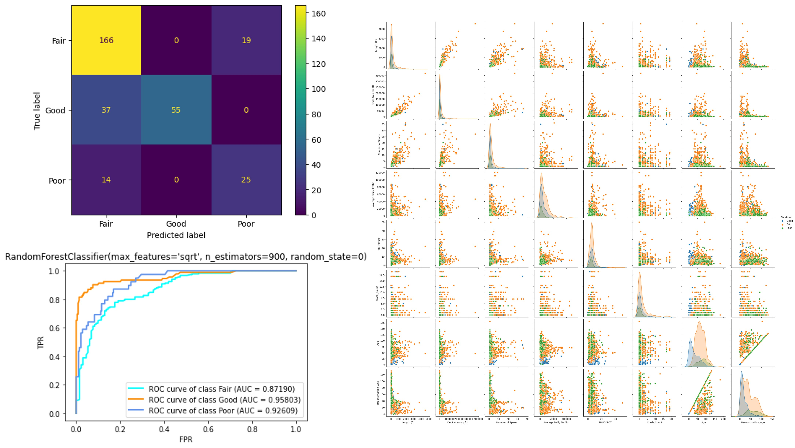
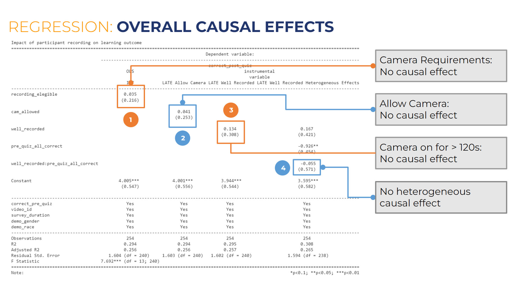
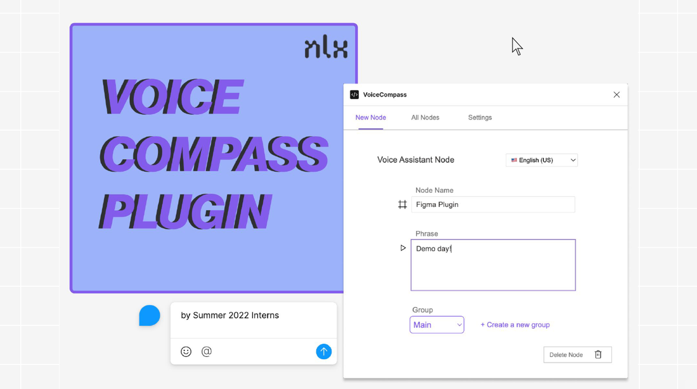
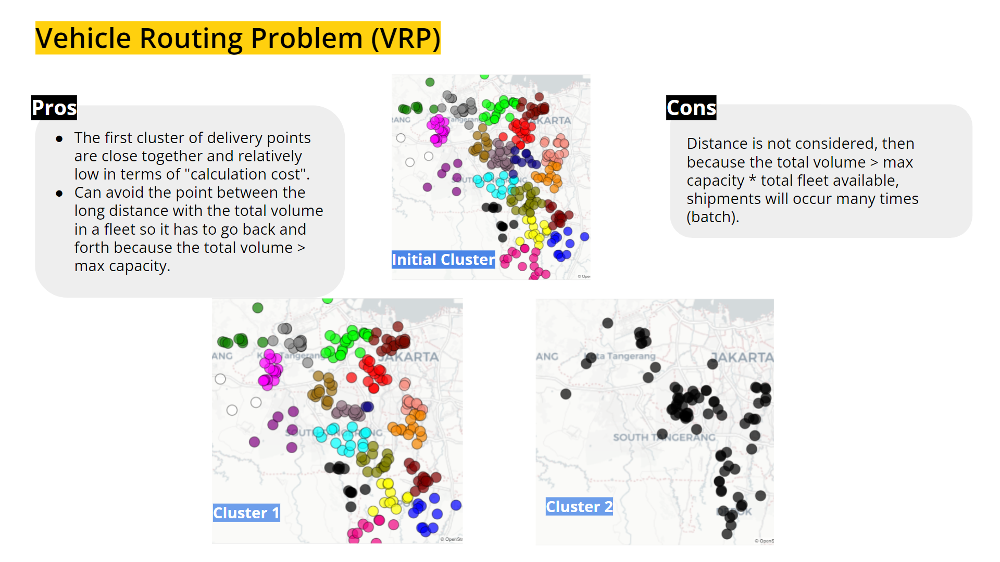
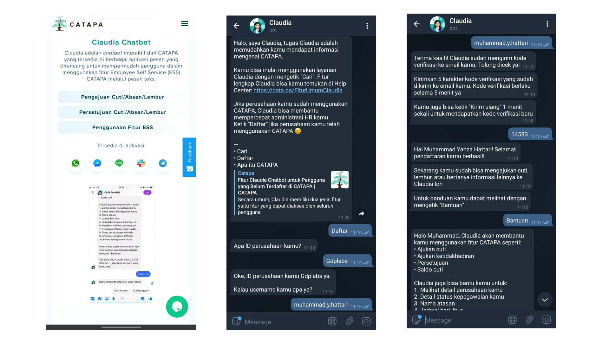
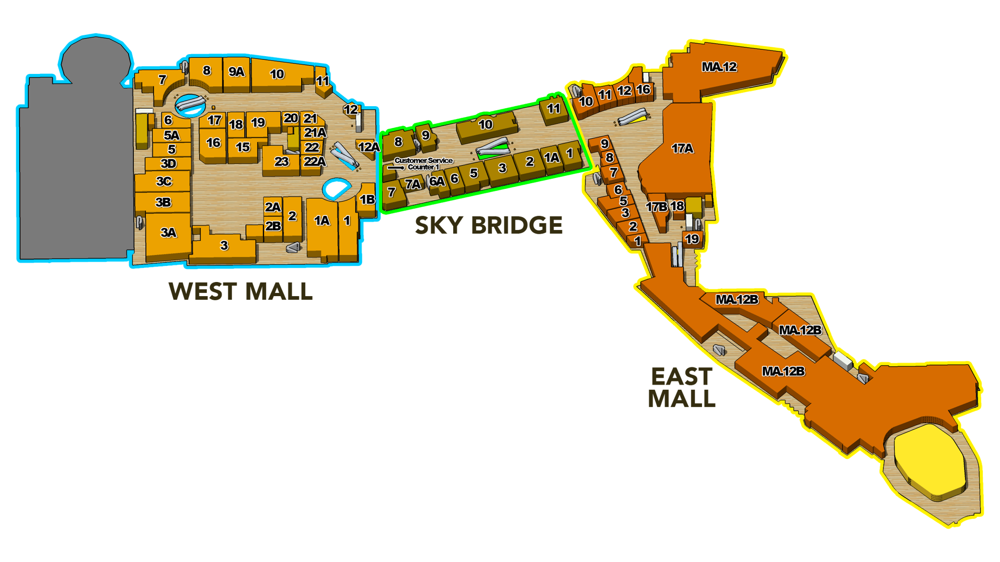

# Portfolio
---
## Data Science

### Pittsburgh Bridge Risk Analysis with Machine Learning

This analysis was originally a project for [***95885 - Data Science and Big Data course***](https://api.heinz.cmu.edu/courses_api/course_detail/95-885/) at Carnegie Mellon University.

This analysis builds a classification model for bridges in Pittsburgh based on their condition. Comprehensive data merging, preprocessing, and exploratory data analysis (EDA) are conducted. After comparing five different models' performance, the best model for bridge condition classification is Random Forest, with an accuracy of 77.8% and a recall rate of 64.1%. As for features' importance, the essential factors in determining the bridges' condition are Substructure Condition, Superstructure Condition, Reconstruction Age, Age, Deck Condition, and Rehab/Replace Eligibility.

---
### H-1B Visa Application Visualization with Altair

This analysis was originally a project for [***95885 - Data Science and Big Data course***](https://api.heinz.cmu.edu/courses_api/course_detail/95-885/) at Carnegie Mellon University.

The H-1B visa is an employment visa for foreign nationals to work in the United States (US). There are over 500,000 applicants yearly for the last five years. In this notebook, we use data visualization, specifically the Altair library, to find insights regarding strategy to have a better chance of being certified for an H-1B visa. The broad analysis considers many aspects, such as wages, policy changes, job titles, job locations, and other interesting things. With this analysis result, I hope H-1B applicants can tailor their strategy to have a better chance of being certified for an H-1B visa.  

---
### Effect of Camera Use in Online Learning on Participant Performance with A/B Testing

This analysis was originally a project for [***95819 - A/B Testing, Design and Analysis course***](https://api.heinz.cmu.edu/courses_api/course_detail/95-819/) at Carnegie Mellon University.

This research aimed to use A/B testing to know whether having the video on and being recorded during online learning affects participant learning. The data used in this research was collected by a [small experiment](https://www.linkedin.com/feed/update/urn:li:activity:6999874128102981632/) asking people with different levels of knowledge of A/B testing to watch a short video about A/B testing and answer some questions to verify their understanding in the end. For comparison, the participant must also answer questions prior to watching the video. When watching the video, some participants were randomly asked to turn on their video. Causal effects were measured with four different regressions: Intention-to-treat (ITT) regression, Local Average Treatment Effect (LATE), LATE within LATE, and LATE with Heterogeneous causal effect.

 

---
## Product Management

### Voice Compass by NLX Figma Plugin

This [product](https://nlx.ai/news/nlx-s-new-figma-plugin-for-voice-compass?utm_content=218434948&utm_medium=social&utm_source=linkedin&hss_channel=lcp-12587283) was developed and released when I worked as a Product Manager intern at [NLX](https://nlx.ai/).

NLX has a platform to build a voice-guided assistant called [Voice Compass](https://nlx.ai/voice-compass). Voice Compass's clients usually design the screen and flow of the assistant with Figma, but a problem was they could not know how the voice assistant would sound. After the client is ready to set their journey design in Voice Compass, unfortunately, they would need to retype, upload, and connect the screen one by one manually. To decrease the lead time of journey creation to production, we built a Figma plugin to import a user-designed flow from Figma to Voice Compass in just a few clicks. It also enables previewing of the audio and visual elements of the journey with a better user experience.

---
### Improve Routing Optimization for Order Delivery with Clustering

These product was developed when I worked as a Product Manager at [Warung Pintar](https://warungpintar.co.id/).

At Warung Pintar, we delivered more than 3000 customers' orders daily from the warehouse. The orders were varied in terms of volume and weight. The addresses of the customers also varied across the Greater Jakarta area. Therefore, we needed to group the delivery in an optimal way to have an efficient cost. To achieve that, we embed the [K-means Clustering](https://www.researchgate.net/publication/344802174_Optimizing_Planning_Service_Territories_by_Dividing_Into_Compact_Several_Sub-areas_Using_Binary_K-means_Clustering_According_Vehicle_Constraints) model to help define the most optimized route to be used by the delivery personnel.

---
### Claudia - CATAPA Chatbot PWA Application to Support Human Resource with Dialogflow

These product was developed when I worked as a Product Manager at [Catapa](https://catapa.com/).

The chatbot was built to support employee self-service to reduce Human Resource (HR) team overtime because employees can independently view and update their data with their mobile phones. The chatbot includes various features such as requesting leave, checking in, managing approval, getting payslips, and viewing employment data. This chatbot was developed using Progressive Web Apps (PWA) and is integrated with existing message services so the user does not need to install a new, big-size app that takes up much space in their mobile phone. 

---
### Grand Indonesia Mall E-directory with Unity

These product was developed when I worked as a Product Manager at [GDP Labs](https://www.gdplabs.id/).

In this project, we redesigned 10 e-directory and 10 customer loyalty kiosks using Unity for [Grand Indonesia](https://www.grand-indonesia.com/). These kiosks enable users to find a store they want to find in the mall, and guide them on how to get there in 3D. Besides that, I provided monthly insights captured with Google Analytics for the strategic team based on the data captured from the kiosks.

---
## Fun Personal Project

### Monika & Andy Wedding Invitation Website

This website was developed by me and hosted on GitHub pages as an invitation for my wedding on January 12, 2024. 

I created this mobile-responsive wedding invitation website using Bootstrap as a library. The site includes features like a countdown, details about the bride and groom, event information, FAQs, a collection of photos and videos, an attendance confirmation system with HTML and Google Sheet, a gift-sending option, and a guest well-wishes section, also powered by Google Sheet. While there's always room for improvement, I'm proud of the result. Feel free to use it for your own wedding invitation or reach out with any questions you may have.

---

© 2024 Monika Sembiring. Powered by Jekyll and the Minimal Theme.

